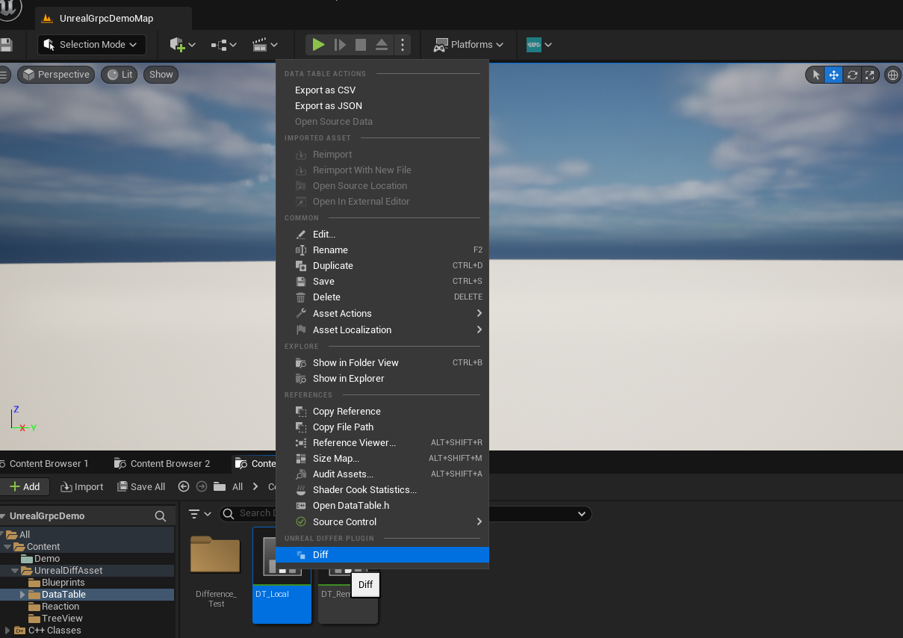

# UE4/5 资源合并插件

## 支持的资源类型

1. DataTable
2. StringTable
3. Blueprint(仅支持合并函数)

## 使用



1. 右键一个资源
2. 选择菜单按钮 “Diff”
3. 从你的计算机上选择另外一个资源

## 对比窗口介绍


### 左侧为项目的资源，右侧为选择的另外一个资源


## 颜色不同点

1. 黄色: 左右两边资源都存在的行, 具体值存在差异

2. 红色: 不存在的行

3. 绿色: 新增的行

4. 合并时：
    ```
    a) 绿色合并到红色相当于往左侧增加该行
    b) 红色合并到绿色相当于在左侧删除该行
    ```

## 右键菜单


1. CopyName: 拷贝行名
2. CopyValue: 拷贝选中行的值


3. Use This Change: 将右侧行覆盖到左侧行
4. Show Difference: 显示具体差异

## 工具栏


1. Prev: 选中上一个差异行
2. Next: 选中下一个差异行
3. Diff: 显示具体差异
4. Merge: 将右侧行覆盖到左侧行
5. ViewOption:

## 具体差异窗口介绍


1. Copy: 拷贝选中的Property值
2. Use This Change: 将左侧的值修改为右侧的值


